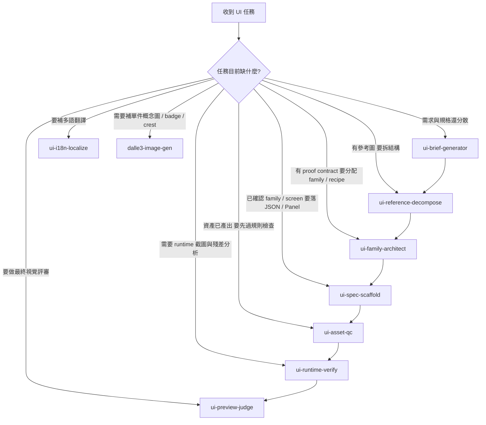

# Keep Consensus — Current Status（§14–§18 · §24 · MCP）

> 這是 `keep.md` 的「Current Status（§14–§18 · §24 · MCP）」分片。完整索引見 `docs/keep.md`。

## 14. MCP 工具鏈現況

`2026-04-04` 已實測可用：
- `figma`
- `playwright`
- `cocos-log-bridge`

另一路可用：
- `cocos-creator` 的 `http://127.0.0.1:3000/mcp` 端點已完成 `initialize / tools/list / scene_* / project_*` 驗證

目前限制：
- `cocos-log-bridge` 與 `cocos-creator` 目前抓到的 scene context 偏向 Editor scene graph，不一定等於 runtime scene。

---

## 15. 量產相關文件

這批文件集中在：
- `artifacts/ui-qa/UI-2-0073/`

關鍵文件：
- `figma-cocos-playwright-production-blueprint-v1.md`
- `figma-component-library-structure-v1.md`
- `figma-proof-mapping-contract-v1.md`
- `ui-spec-skeleton-scaffolder-2026-04-04.md`
- `mcp-smoke-test-report-2026-04-04.md`
- `proof-mapping-template.detail-split.json`
- `proof-mapping-template.dialog-card.json`
- `proof-mapping-template.rail-list.json`

---

## 16. 架構評估（2026-04-05，Agent1）

完整報告：`docs/架構評估報告_2026-04-05_Agent1.md`

發現 7 個架構缺口，已全數開單（UI-2-0074 ~ UI-2-0079）：

| 卡號 | 問題 | 優先 | 狀態 |
|------|------|------|------|
| UI-2-0074 | UIConfig UIID 只有 6 個入口；22 個畫面繞過 UIManager | **P0** | ✅ done |
| UI-2-0075 | UISpecLoader 15 個獨立 new 實例，無共享快取 | P1 | ✅ done |
| UI-2-0076 | Binder 遷移：11 個元件仍用手動節點操作 | P1 | 🔄 in-progress |
| UI-2-0077 | 14 個元件 `loadI18n('zh-TW')` 硬編碼 | P1 | ✅ done |
| UI-2-0078 | MemoryManager 為空殼（無 LRU / releaseByScope） | P2 | open |
| UI-2-0079 | `UILayerName` deprecated enum 殘留 Constants.ts | P3 | ✅ done |

Phase E（新增）= 架構補強優先序列，最終目標是讓 UIManager 覆蓋全部 22+ 個畫面。

---

## 17. UIConfig / UIManager 現況（2026-04-05，Agent1）

### UIConfig.ts UIID enum（25 入口）

| 層級 | UIID 清單 |
|------|-----------|
| Game | BattleHUD, DeployPanel, BattleLogPanel, TigerTallyPanel, ActionCommandPanel |
| UI | LobbyMain, ShopMain, GachaMain, Gacha, GeneralList, BloodlineMirrorAwakening |
| PopUp | GeneralDetail, GeneralDetailBloodline, GeneralPortrait, GeneralQuickView, UnitInfoPanel, SupportCard, SpiritTallyDetail, EliteTroopCodex |
| Dialog | DuelChallenge, ResultPopup |
| System | SystemAlert, NetworkStatus, BloodlineMirrorLoading |
| Notify | Toast |

所有 PopUp/UI 層新入口已填入 `prefab` 佔位路徑（`"ui/<name>"`）——待 Prefab 實際落地後路徑才有效。

### UIManager.ts 新 API

```typescript
// 注入層級容器節點（SceneController 的 onLoad 中呼叫一次）
services().ui.setupLayers({ [LayerType.UI]: lobbyContainer, [LayerType.PopUp]: popupContainer });

// 非同步開啟（自動 loadPrefab → instantiate → register → open）
await services().ui.openAsync(UIID.LobbyMain);

// 同步開啟（已 register 的場景節點舊路徑，保持向後相容）
services().ui.open(UIID.BattleHUD);
```

---

## 18. 目前下一步

### 已完成（第十六批，commit `8d3eebf`，2026-04-05）

- ✅ **P1 完成**：UI-2-0077（i18n 脫硬編碼 — 15 元件全改用 `services().i18n.currentLocale`）
- ✅ **P1 完成**：DATA-1-0001（BattleBindData.ts — 5 介面 + 38 bind path 替換，commit `4204172`）
- ✅ **Bug 修復**：VFX prewarm 改用 vfx_core bundle；UISkinResolver null-texture 防禦（commit `41f2dab`）
- ✅ **框架落地**：`UIPreviewBuilder.buildScreen()` 完成 `onReady(binder)` 框架（Widget realignment pass + `UITemplateBinder` 綁定 + `clearDynamic` 佔位清除）
- ✅ **契約擴充**：`UISpecTypes.ts` 新增 `WidgetDef.hCenter/vCenter`、`scroll-view` nodeType、`UIWidgetFragmentSpec` / `UITemplateParamDef` / `UITemplateComposeItem`
- ✅ **BattleScene 修正**：`BattleScenePanel.ensureCanvasHost()` 統一設定 layer / 1920×1080 / `Widget.AlignMode.ALWAYS`，解決子面板不渲染與 Widget 錯位
- ✅ **SceneManager 橋接**：新增 `boardRenderer` 橋接（`registerBoardRenderer` / `getBoardRenderer`）
- ✅ **文件**：`cross-reference-index.md` 更新至第十六批（UI Core 子節 + 10 個核心 TS 首次建立索引）

### 立即下一步（Agent1 最優先）

- ✅ **P1 完成**：**UI-2-0076**（Binder 遷移完成，commit `845cae1`）
  - StyleCheckPanel: `onBuildComplete` → `onReady`
  - GeneralPortraitPanel: `getChildByPath` 按鈕綁定 → `onReady(binder)`
  - GeneralListPanel: `getChildByPath` 按鈕綁定 → `onReady(binder)`
  - GeneralDetailPanel: `_bindStaticEvents()` + `_setupClickBlocker()` + `_ensureOverviewShell()` → `onReady(binder)`
  - GeneralDetailOverviewShell: 新增 `onReady(binder)` 收斂點，路徑輔助方法維持向後相容
  - 附加修復：BattleScene.ts JSDoc 中 stray code 誤植已清除

### 後續排程

- ~~P2：UI-2-0078（MemoryManager LRU + releaseByScope）~~ ✅ done（2026-04-05）
- 為 LobbyMain / ShopMain / Gacha 建立真正的 Prefab，讓 `openAsync` 完整走通
- 解除 UI-2-0046 blockers → 繼續 UI-2-0026（BattleScene 對位修正）
- 收斂 slot-map 匯出格式，讓它能直接轉成 scaffolder config JSON
- 繼續校正 `cocos-log-bridge` 的 scene context
- 持續擴充 template family，但遵守 template-first，而不是為單一畫面濫開新模板

---

## MCP 工具與 API 金鑰 (MCP Tools & API Keys)
- **OpenAI DALL-E 3 MCP Server**: 專案已建立專屬的 MCP Server 以支援 DALL-E 3 影像生成（位於 	ools_mcp/dalle3-mcp/）。
- **DALL-E 3 共用 Skill**: 若要讓 Agent 用統一方式呼叫生圖，優先使用 `.github/skills/dalle3-image-gen/`；此 skill 會透過 wrapper 腳本連到既有 MCP server，而不是各自重寫臨時 client。
- **API 金鑰安全規範**: OpenAI API Key (sk-proj-...) 已加密存放於 	ools_mcp/dalle3-mcp/.env 中。**嚴禁將明碼金鑰寫入任何 Markdown 或程式碼中**。其他 Agent 若需調用 OpenAI 相關服務，請直接讀取該 .env 檔案的 OPENAI_API_KEY 環境變數。
## 24. Project Skills Sync（2026-04-06）

- `.github/skills/` 為本專案共用 skill 的來源目錄，新的對話開始時應優先以這裡為準。
- 本機安裝目錄為 `C:\Users\User\.codex\skills\`，可用 `powershell -ExecutionPolicy Bypass -File tools_node/sync-project-skills.ps1` 將專案 skills 同步到本機。
- 同步採非破壞式覆寫：會更新同名 project skills，但不會刪除本機其他既有 skills。
- 若後續產生新的專案 skill，應優先回寫到 `.github/skills/`，再執行同步腳本，讓所有 Agent 可共用同一套 skills。
- `.agents/workflows/*.md` 目前視為 workflow 草稿來源，不視為正式自動執行入口；若某條流程要長期使用，應升級為 `.github/skills/<skill>/SKILL.md`。
- `ui-generate-brief`、`ui-scaffold`、`ui-verify`、`ui-i18n-translate` 已正式升級為 project skills：
  - `ui-brief-generator`
  - `ui-spec-scaffold`
  - `ui-runtime-verify`
  - `ui-i18n-localize`
- `ui-design-to-code`、`ui-generate-reference` 先保留在 `.agents/workflows/` 當草稿，不列入正式入口；前者依賴舊版 Stitch / layout 路徑，後者容易把 AI 整頁 mockup 誤當 canonical reference。

### 24.1 UI Skill 入口圖（Agent 進場路由）

後續 Agent 只要碰到 UI 任務，優先照這張入口圖選 skill，不要再從 `.agents/workflows/*.md` 猜流程。



### 24.2 最常見 4 種入口

1. 新畫面剛開工：
   `ui-brief-generator` → `ui-reference-decompose` → `ui-family-architect` → `ui-spec-scaffold`
2. 已有 ui-spec，要看 runtime：
   `ui-runtime-verify`
3. 已有資產，要先卡品質門：
   `ui-asset-qc` → `ui-runtime-verify` → `ui-preview-judge`
4. 已有 zh-TW 文案，要補多語：
   `ui-i18n-localize`
- 2026-04-06 新增 `.agents/skills/context-budget-guard/SKILL.md` 與 `tools_node/summarize-structured-diff.js`，之後凡是圖片批次、compare board、大型 `md/json`、長 handoff，都先走 skill 與摘要腳本，不再直接把整份內容塞進對話。
- 2026-04-06 收工前一律補 `Token 量級：少 / 中 / 大` 的估算回報；標準命令為 `node tools_node/report-turn-usage.js --files <file...> --emit-final-line`，若無法精準列 touched files，至少跑 `--changed`。這是估算值，不是假裝成 API 精準計費。
- 2026-04-06 新增 `(best)` 專案口令：只要使用者訊息以 `(best)` 開頭，就視為 strict mode，必須先走 `.agents/skills/best-mode/SKILL.md`，再走 `context-budget-guard`，禁止直接貼整份大檔、compare board、批次 screenshot 或大型 diff。
- 2026-04-06 新增 wrapper 架構：UI 任務優先走 `node tools_node/run-ui-workflow.js --workflow <workflow-id> ...`，非 UI 但有圖片/大檔/重 diff 的任務優先走 `node tools_node/run-guarded-workflow.js --workflow <name> ...`，收工前優先走 `node tools_node/finalize-agent-turn.js ...`；底層共用 `tools_node/lib/context-guard-core.js`。
