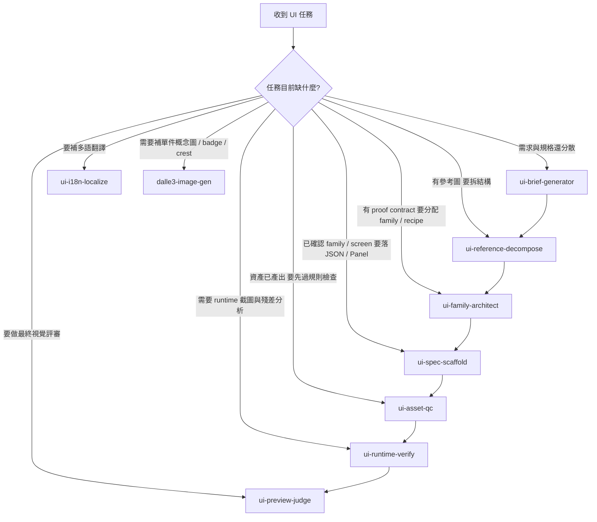

# Keep Consensus

## P0. Agent Context Budget（2026-04-06）

- 這件事列為目前第一最高優先級：任何會讓 Agent 對話上下文暴增的流程，都要先收斂再繼續。
- 真正高風險來源不是一般程式碼，而是整份 `keep.md` / `ui-quality-todo.json`、QA compare board、screenshot、AI 原圖、binary diff、以及同一輪重複貼入相同背景。
- 強制規則：Agent handoff 改用「摘要卡」，只傳任務目標、1~3 個必要檔案、3 點已知結論、3 點未決策項目、1 條驗證方式；禁止把整份 manifest、長篇 notes、成批圖片直接塞進對話。
- 圖片節流：單次對話最多 2 張圖；只允許 1 張主圖 + 1 張對照圖，其餘只保留路徑、尺寸、用途與 QA 結論。
- 文件節流：`keep.md` 只留最高層共識與 P0 警戒；長分析搬去 `docs/agent-context-budget.md`，在 keep 只留索引。
- 警戒線：單檔文字估算超過 `6000 tokens` 禁止整份讀入；單輪估算超過 `18000 tokens` 必須提出警告；超過 `30000 tokens` 視為 `hard-stop`，必須先縮成摘要卡。
- 工具：handoff 前先跑 `node tools_node/check-context-budget.js --changed --emit-keep-note`；若出現 `warn` 或 `hard-stop`，要先警告，再把原因寫回 keep。
- 爆量事件紀錄格式：日期、估算 token 量級、疑似原因、已採取的縮減策略、是否列為 P0。不要把整份分析全文再寫回 keep，避免二次膨脹。
- 詳細規範文件：`docs/agent-context-budget.md`
- 2026-04-06 現況掃描：`node tools_node/check-context-budget.js --scan-default --emit-keep-note` 估算約 `791656 tokens`，`--changed` 估算約 `429502 tokens`，兩者皆為 `hard-stop`。疑似主因：compare board / screenshot / QA 圖片被納入、`keep.md` / `ui-quality-todo.json` / 大型 docs 被整份讀入、changed files 含大量 binary 與大型資料檔。這件事維持 P0，直到 handoff 全面改成摘要卡與路徑索引為止。

## 0. UI 任務 Shard 入口（2026-04-05）

- `docs/ui-quality-tasks/*.json` 是 UI 任務機器可讀資料的可編輯 shard 來源。
- `docs/ui-quality-todo.json` 改為 aggregate manifest，由 `node tools_node/build-ui-task-manifest.js` 生成。
- `docs/agent-briefs/tasks_index.md` 也由同一支生成器重建，不再建議手工維護。
- 新任務的建議順序：
  1. 建立任務卡 Markdown
  2. 新增或更新對應 shard
  3. 執行 `node tools_node/build-ui-task-manifest.js`
  4. 執行 encoding touched check
- 過渡期允許舊任務仍保留在 `docs/ui-quality-todo.json`；新任務優先走 shard，不要求一次搬完整份歷史資料。

更新日期: `2026-04-06`

本文件是目前專案的最高共識摘要。每次新會話開始時，先讀本檔，再開始任何分析、改碼、測試或文件工作。

---

## 1. 專案基準

- 專案: `3KLife`
- 引擎: `Cocos Creator 3.8.8`
- 工作流: `IDE-first`
- 語言: `TypeScript (ES2015)`
- 主要平台: `Web / Android / iOS`
- 階段: `資料管理中心 (DC Phase) 基礎建設完成 / UI 量產期`

Unity 對照:
- `Cocos Creator Editor` 對應 Unity Editor
- `assets/resources` 對應 Resources / Addressables 可載入資料根

---

## 2. Pre-flight

1. 每次處理任何請求前，先讀 `docs/keep.md`。
2. 回覆與推理一律使用繁體中文與台灣慣用術語。
3. 若有新技術決策，必須補回 `docs/keep.md`。
4. 新會話開始時，先摘要 keep 目前重點。
5. 規格異動優先回寫正式母規格，不把補遺當成長期單一真相來源。
6. 補遺只允許作為短期工作底稿、compare note 或跨功能整理；若不是全新功能規格，結案前必須併回正式規格書。
7. 只要正式規格書有新增、刪改或重定位，必須同步更新 `docs/cross-reference-index.md`。
8. 若內容同時影響系統規格與 UI 呈現，至少要同步更新主要系統規格書、`docs/UI 規格書.md` 與交叉索引。

---

## 2b. Agent 工具安全規則（2026-04-06）

### ❌ 禁止呼叫 `get_changed_files`

本專案包含大量 PNG / binary QA artifact，`get_changed_files` 會把所有 unstaged/staged diff（含 PNG binary 內容）一次塞入 context，必定觸發 **413 Request Entity Too Large** 並導致 Agent 凍結當機。

**絕對不要呼叫 `get_changed_files`，無論任何情況。**

替代方式：
- 查目前 git 狀態：用 `run_in_terminal` 跑 `git status --short`（只回傳路徑，不含 diff）
- 查特定文字檔的 diff：用 `run_in_terminal` 跑 `git diff -- <filepath>`（限定 `.ts` / `.json` / `.md`，不要用萬用路徑）
- 查最新 commit 資訊：用 `run_in_terminal` 跑 `git log -1 --stat`

### ⚠️ 其他工具使用注意

- `grep_search` 不要用萬用路徑 `**` 搜尋 `artifacts/` 目錄（大量 PNG 會拖慢搜尋，且結果無用）
- `file_search` 查 png artifact 路徑時加 `maxResults: 10`，不要讓結果暴增

---

## 3. Cocos 工作流

- 正式建置與資產流程仍由 Cocos Creator Editor 管理，不以 npm script 取代。
- Editor 入口以 `http://localhost:7456` 為主。
- asset refresh 可用：

```bash
curl.exe http://localhost:7456/asset-db/refresh
```

- 不手改：
  - `library/`
  - `temp/tsconfig.cocos.json`
  - `profiles/v2/`
  - `settings/v2/`
  - `.meta`

---

## 4. 編碼防災

- 所有文字檔必須維持 `UTF-8 without BOM`。
- 高風險副檔名：
  - `.md`
  - `.json`
  - `.ts`
  - `.js`
  - `.ps1`
- 禁止把 `Set-Content -Encoding UTF8` 當成安全寫檔方式。
- 也避免直接用 `Out-File` 重寫重要文字檔。
- 修改高風險文字檔後，立刻跑：

```bash
node tools_node/check-encoding-touched.js --files <file...>
```

- 高風險檔修改前可先跑：

```bash
npm run prepare:high-risk-edit -- <file>
```

- `docs/keep.md` 本身是高風險檔；若再出現亂碼，優先用「重建乾淨 UTF-8 文本」修復，不做猜字修補。

---

## 5. 任務卡 / Agent 協作

### 任務卡原則

- 正式工作原則上先有任務卡，再進入實作、重構、正式 QA 或批次文件整理。
- `docs/ui-quality-todo.json` 是 UI 任務狀態的單一真相來源。
- 若工作範圍擴大、衍生 blocker 或新子題，先更新 `related / depends / notes`，必要時補開新卡。

### 鎖卡規則

- 開工先鎖卡，再做事。
- 鎖卡至少要補：
  - `status: in-progress`
  - `started_at`
  - `started_by_agent`
  - `notes` 第一行寫明誰在何時開始、先做什麼
- 若只是閱讀或查資料，不應鎖卡。

### 交接規則

- 任務卡被某個 Agent 鎖定後，其他 Agent 不重複實作同一張卡。
- 若要接手，先在卡上補交接說明。
- 若已鎖卡但暫停，必須補上目前狀態、阻塞與下一步建議。

### Notes 格式

```text
YYYY-MM-DD | 狀態: in-progress | 處理: <本輪內容> | 驗證: <已做驗證> | 阻塞: <若無則寫無>
```

### 分工共識

- Agent1 主要偏向：
  - runtime
  - preview host
  - UI contract
  - tooling
  - 重構
- Agent2 主要偏向：
  - QA
  - artifact
  - compare board
  - refinement 追蹤
  - screen-context 驗證

### 撞檔規則

- 多個 Agent 不同時修改同一個高風險檔。
- 高風險檔包含：
  - `docs/keep.md`
  - `UIPreviewBuilder.ts`
  - 大型中文 Markdown
  - 核心 JSON 契約檔

---

## 6. Git 規則

- 不做破壞性 git 操作。
- 不覆蓋不是自己做的變更。
- commit message 格式：

```text
[bug|feat|chore] 主題: 說明 [AgentX]
```

---

## 7. UI 契約基礎

- UI 必須維持資料驅動，不回退成「每個畫面手調 Prefab 當唯一真實來源」。
- 正式 UI 契約為三層 JSON：
  - `assets/resources/ui-spec/layouts/`
  - `assets/resources/ui-spec/skins/`
  - `assets/resources/ui-spec/screens/`
- 全域設計 token：
  - `assets/resources/ui-spec/ui-design-tokens.json`

### 7.1 BattleScene UI Data Schema Contract（DATA-1-0001，完成於 2026-04-05）

- 正式 TS 介面定義：`assets/scripts/core/data/BattleBindData.ts`
- 定義 5 個介面（Unity 對照：相當於 ViewModel / SerializedField 的資料契約）：
  - `BattleStateData`：`battleState.*`（玩家/敵方名稱、城牆 HP、回合數、糧食、狀態訊息）
  - `UnitDisplayData`：`unit.*`（單位名稱、副稱、攻防血速費用、描述）
  - `TallyUnitData`：`tally[n].*`（虎符列表各格的 atk/hp/badge/unitName/cost）
  - `BattleActionData`：`battle.*`（奧義名稱、SP 百分比）
  - `BattleLogData`：`battleLog.*`（戰報訊息）
- 5 個 layout JSON 中共 38 個 `bind:"dynamic"` 已全部替換為明確 bind path
- `UIPreviewNodeFactory` 現在將 bind path 節點顯示為 `{battleState.playerName}` 格式佔位文字
- **重要**：所有新 UI 動態 label 的 bind 欄位必須使用 BattleBindData 契約中定義的 path，不得再寫 `"dynamic"`

Unity 對照:
- `layout` 類似 Prefab 結構
- `skin` 類似 Theme / Sprite mapping
- `screen` 類似 route / 開啟設定

### 7.2 Design Token 使用規則（2026-04-05）

**核心原則：skin / fragment JSON 中的所有顏色欄位，一律引用 `ui-design-tokens.json` 中的 token key，禁止直接寫 hex 硬編碼。**

#### ✅ 正確寫法

```json
{ "kind": "color-rect",  "color": "surfaceParchmentFill", "alpha": 230 }
{ "kind": "label-style", "color": "textOnParchment" }
{ "kind": "color-rect",  "color": "dividerOnParchment" }
```

#### ❌ 禁止寫法

```json
{ "kind": "color-rect",  "color": "#F0E8D8E6" }
{ "kind": "label-style", "color": "#2D2926" }
{ "kind": "color-rect",  "color": "#8C7A66" }
```

#### 完整解釋

- `UISkinResolver.resolveColor()` 是唯一的顏色解析出口：收到 token key → 查 `tokens.colors[key]` → 取 hex；若查不到則 fallback `Color.WHITE`。
- 直接寫 hex 雖然短期能用，但繞過了 token 系統，主題切換或 token 更新時無法統一同步。
- 未在 `ui-design-tokens.json` 中存在的顏色語意，**必須先補 token**，再在 skin 裡引用；不得把新顏色直接寫入 skin 或 fragment。

#### 透明度表示方式

- `color-rect`：透明度用 `"alpha": 0–255`（整數），不要把 alpha 寫進 8位 hex。
- `sprite-frame`：透明度用 `"opacity": 0.0–1.0`（浮點）。
- label 顏色固定不透明，不需要 alpha 欄位。

#### 現有 Token 對照速查（羊皮紙系列）

| 語意 | Token key | hex |
|------|-----------|-----|
| 羊皮紙填色背景 | `surfaceParchmentFill` | `#F0E8D8` |
| 羊皮紙底色 | `surfaceParchment` | `#E8DFD0` |
| 主要文字（深褐） | `textOnParchment` | `#2D2926` |
| 次要文字（中褐） | `textOnParchmentMuted` | `#6B5E4E` |
| 強調文字（金） | `secondary` | `#D4AF37` |
| 分隔線 | `dividerOnParchment` | `#8C7A66` |

#### Token 命名收斂規則（2026-04-06）

- 舊 token key 先保留相容性，不在同一輪大規模改名既有 skin。
- 新畫面、新 skin、新 family 優先使用分層 alias：
  - `accent.gold.*`
  - `accent.jade.*`
  - `surface.parchment.*`
  - `text.parchment.*`
  - `divider.parchment`
- 若只是沿用既有畫面，可暫留 `secondary`、`surfaceParchmentFill`、`stdButtonPrimary` 等舊 key；但新增 token 不再優先擴張舊式平鋪命名。

---

## 8. UI Template 新架構

Agent1 已把 UI templates 重構成可重用架構，這是後續 UI 量產的核心基礎。

### 主要實體

- `assets/scripts/ui/core/UITemplateResolver.ts`
- `assets/scripts/ui/core/UITemplateBinder.ts`
- `assets/scripts/ui/core/UISpecTypes.ts`
- `assets/resources/ui-spec/templates/`
- `assets/resources/ui-spec/fragments/widgets/`
- `assets/resources/ui-spec/fragments/layouts/`
- `assets/resources/ui-spec/fragments/skins/`

### 已落地模板

- `dialog-confirm`
- `dialog-info`
- `dialog-select`
- `fullscreen-result`

### 核心意義

- Template 負責骨架
- Widget Fragment 負責可重用區塊
- Skin Fragment 負責視覺片段
- Binder 負責節點綁定

這代表 UI 不再是「每次重畫一個新畫面」，而是「優先挑既有 template / widget family，再做 screen-specific 變化」。

---

## 9. 美術 × 技術量產協作規則

這是目前最重要的新共識。

### Template-first 原則

- 美術在開始新畫面前，先指定「這張畫面屬於哪個已存在 template family」。
- 若某個 family 已接上 runtime 但視覺仍停在 placeholder，第一步優先把 `color-rect` 換成既有 family 可重用的 skin slot，不要直接跳去重做整張畫面或重排節點。
- 若能用既有 template 解決 70% 以上結構，就不得把它當成全新畫面重做。
- 只有在既有 template 明顯不適用時，才新增新 template。

### 美術交付順序

1. 先選 template family
2. 再做 wireframe
3. 再做 slot-map
4. 最後才做 screen-specific 視覺強化

### 技術配合

- 技術側要盡量把「共用骨架」沉到 template / fragment，不把共通結構散落在單一 screen JSON。
- 新畫面若只是同一家族的變體，優先新增 config、skin 或 fragment，不急著新增 template。

### 現階段模板家族

- `detail-split`
- `dialog-card`
- `rail-list`

---

## 10. Figma + Cocos + Playwright 量產線

正式量產線：

1. `UI_PROOF_TEMPLATE`
2. `Figma`
3. `wireframe`
4. `slot-map`
5. `ui-spec skeleton`
6. `preview / Playwright QA`

Figma 檔案：
- `https://www.figma.com/design/lf8ByZq8VVBtBTBJ0IpahX`

規則：
- `09_Proof Mapping` 不只是設計備註區，必須逐步收斂成 tooling 可直接吃的中介層。
- family naming 必須對應 repo 內 skeleton 生成器輸入。

---

## 11. UI Skeleton 量產入口

repo 內正式量產入口：
- `tools_node/scaffold-ui-spec-family.js`

目前支援模板：
- `detail-split`
- `dialog-card`
- `rail-list`

可直接從 config JSON 產出三層骨架：

```bash
node tools_node/scaffold-ui-spec-family.js --config <json>
```

命名規則：
- `familyId` 用 kebab-case
- layout: `<family>-main.json`
- skin: `<family>-default.json`
- screen: `<family>-screen.json`
- slot prefix: `familyId` 的 `-` 轉 `.`

---

## 12. Proof Mapping Contract

`09_Proof Mapping` 至少要維持這些欄位：

- `familyId`
- `template`
- `uiId`
- `bundle`
- `atlasPolicy`
- `titleKey`
- `bodyKey`
- `primaryKey`
- `secondaryKey`
- `tabs`
- `railItems`
- `proofVersion`
- `figmaFrame`
- `wireframeRef`
- `slotMapRef`
- `notes`

若某份設計沒有對應到這組欄位，視為尚未進入正式量產入口。

---

## 13. QA / 驗證

- 先走 preview / capture / contract 驗證，不靠肉眼口頭比對。
- 收工前至少要能跑：

```bash
node tools_node/validate-ui-specs.js
```

- touched-files 編碼檢查：

```bash
node tools_node/check-encoding-touched.js --files <file...>
```

- 完整驗收：

```bash
node tools_node/run-acceptance.js
```

---

## 14. MCP 工具鏈現況

`2026-04-04` 已實測可用：
- `figma`
- `playwright`
- `cocos-log-bridge`

另一路可用：
- `cocos-creator` 的 `http://127.0.0.1:3000/mcp` 端點已完成 `initialize / tools/list / scene_* / project_*` 驗證

目前限制：
- `cocos-log-bridge` 與 `cocos-creator` 目前抓到的 scene context 偏向 Editor scene graph，不一定等於 runtime scene。

---

## 15. 量產相關文件

這批文件集中在：
- `artifacts/ui-qa/UI-2-0073/`

關鍵文件：
- `figma-cocos-playwright-production-blueprint-v1.md`
- `figma-component-library-structure-v1.md`
- `figma-proof-mapping-contract-v1.md`
- `ui-spec-skeleton-scaffolder-2026-04-04.md`
- `mcp-smoke-test-report-2026-04-04.md`
- `proof-mapping-template.detail-split.json`
- `proof-mapping-template.dialog-card.json`
- `proof-mapping-template.rail-list.json`

---

## 16. 架構評估（2026-04-05，Agent1）

完整報告：`docs/架構評估報告_2026-04-05_Agent1.md`

發現 7 個架構缺口，已全數開單（UI-2-0074 ~ UI-2-0079）：

| 卡號 | 問題 | 優先 | 狀態 |
|------|------|------|------|
| UI-2-0074 | UIConfig UIID 只有 6 個入口；22 個畫面繞過 UIManager | **P0** | ✅ done |
| UI-2-0075 | UISpecLoader 15 個獨立 new 實例，無共享快取 | P1 | ✅ done |
| UI-2-0076 | Binder 遷移：11 個元件仍用手動節點操作 | P1 | 🔄 in-progress |
| UI-2-0077 | 14 個元件 `loadI18n('zh-TW')` 硬編碼 | P1 | ✅ done |
| UI-2-0078 | MemoryManager 為空殼（無 LRU / releaseByScope） | P2 | open |
| UI-2-0079 | `UILayerName` deprecated enum 殘留 Constants.ts | P3 | ✅ done |

Phase E（新增）= 架構補強優先序列，最終目標是讓 UIManager 覆蓋全部 22+ 個畫面。

---

## 17. UIConfig / UIManager 現況（2026-04-05，Agent1）

### UIConfig.ts UIID enum（25 入口）

| 層級 | UIID 清單 |
|------|-----------|
| Game | BattleHUD, DeployPanel, BattleLogPanel, TigerTallyPanel, ActionCommandPanel |
| UI | LobbyMain, ShopMain, GachaMain, Gacha, GeneralList, BloodlineMirrorAwakening |
| PopUp | GeneralDetail, GeneralDetailBloodline, GeneralPortrait, GeneralQuickView, UnitInfoPanel, SupportCard, SpiritTallyDetail, EliteTroopCodex |
| Dialog | DuelChallenge, ResultPopup |
| System | SystemAlert, NetworkStatus, BloodlineMirrorLoading |
| Notify | Toast |

所有 PopUp/UI 層新入口已填入 `prefab` 佔位路徑（`"ui/<name>"`）——待 Prefab 實際落地後路徑才有效。

### UIManager.ts 新 API

```typescript
// 注入層級容器節點（SceneController 的 onLoad 中呼叫一次）
services().ui.setupLayers({ [LayerType.UI]: lobbyContainer, [LayerType.PopUp]: popupContainer });

// 非同步開啟（自動 loadPrefab → instantiate → register → open）
await services().ui.openAsync(UIID.LobbyMain);

// 同步開啟（已 register 的場景節點舊路徑，保持向後相容）
services().ui.open(UIID.BattleHUD);
```

---

## 18. 目前下一步

### 已完成（第十六批，commit `8d3eebf`，2026-04-05）

- ✅ **P1 完成**：UI-2-0077（i18n 脫硬編碼 — 15 元件全改用 `services().i18n.currentLocale`）
- ✅ **P1 完成**：DATA-1-0001（BattleBindData.ts — 5 介面 + 38 bind path 替換，commit `4204172`）
- ✅ **Bug 修復**：VFX prewarm 改用 vfx_core bundle；UISkinResolver null-texture 防禦（commit `41f2dab`）
- ✅ **框架落地**：`UIPreviewBuilder.buildScreen()` 完成 `onReady(binder)` 框架（Widget realignment pass + `UITemplateBinder` 綁定 + `clearDynamic` 佔位清除）
- ✅ **契約擴充**：`UISpecTypes.ts` 新增 `WidgetDef.hCenter/vCenter`、`scroll-view` nodeType、`UIWidgetFragmentSpec` / `UITemplateParamDef` / `UITemplateComposeItem`
- ✅ **BattleScene 修正**：`BattleScenePanel.ensureCanvasHost()` 統一設定 layer / 1920×1080 / `Widget.AlignMode.ALWAYS`，解決子面板不渲染與 Widget 錯位
- ✅ **SceneManager 橋接**：新增 `boardRenderer` 橋接（`registerBoardRenderer` / `getBoardRenderer`）
- ✅ **文件**：`cross-reference-index.md` 更新至第十六批（UI Core 子節 + 10 個核心 TS 首次建立索引）

### 立即下一步（Agent1 最優先）

- ✅ **P1 完成**：**UI-2-0076**（Binder 遷移完成，commit `845cae1`）
  - StyleCheckPanel: `onBuildComplete` → `onReady`
  - GeneralPortraitPanel: `getChildByPath` 按鈕綁定 → `onReady(binder)`
  - GeneralListPanel: `getChildByPath` 按鈕綁定 → `onReady(binder)`
  - GeneralDetailPanel: `_bindStaticEvents()` + `_setupClickBlocker()` + `_ensureOverviewShell()` → `onReady(binder)`
  - GeneralDetailOverviewShell: 新增 `onReady(binder)` 收斂點，路徑輔助方法維持向後相容
  - 附加修復：BattleScene.ts JSDoc 中 stray code 誤植已清除

### 後續排程

- ~~P2：UI-2-0078（MemoryManager LRU + releaseByScope）~~ ✅ done（2026-04-05）
- 為 LobbyMain / ShopMain / Gacha 建立真正的 Prefab，讓 `openAsync` 完整走通
- 解除 UI-2-0046 blockers → 繼續 UI-2-0026（BattleScene 對位修正）
- 收斂 slot-map 匯出格式，讓它能直接轉成 scaffolder config JSON
- 繼續校正 `cocos-log-bridge` 的 scene context
- 持續擴充 template family，但遵守 template-first，而不是為單一畫面濫開新模板

---

## 19. UI 量產主工作流（2026-04-05）

這一段是之後所有 UI Agent 都必須遵守的正式生產規則。若未來流程再演化，優先回寫本節與 `docs/UI 規格書.md`，不要把新共識只留在任務卡或補遺。

### 19.1 核心原則

- UI 量產的正式順序固定為：`先選 template family -> 再填 content contract -> 最後套 skin fragment`。
- `layout / template` 只描述穩定結構，`content contract` 只描述角色或畫面內容差異，`skin / fragment` 只描述視覺風格與素材映射。
- 若只是文案、故事條、血脈、徽記、狀態切換不同，優先修改 `content contract`，不要回頭重切 `layout JSON`。
- 若只是紙材、框體、紋樣、配色、按鈕 family 不同，優先修改 `skin fragment`，不要複製一份新 `layout`。
- 只有當畫面結構、導覽模型、slot 數量或互動骨架改變時，才允許新增 template family 或修改 template skeleton。

### 19.2 標準落地步驟

1. 先判定這張畫面屬於哪個 template family，例如 `detail-split`、`dialog-card`、`rail-list`。
2. 在 Figma `09_Proof Mapping` 或對應 config 內補齊 `familyId / template / tabs / railItems / titleKey / bodyKey / notes` 等正式欄位。
3. 以 scaffolder 生成三層骨架：`layouts / skins / screens`。
4. 將角色差異、系統差異、故事差異收斂到 `content contract`，例如 `storyStripCells / crestState / bloodlineRumor`。
5. 將視覺差異收斂到 `skin fragment`、token、atlas policy 與既有 widget family。
6. 只在最後一步做 screen-specific 收尾；若收尾超過 20% 結構修改，代表 template family 判定可能錯了，應回頭重評估。
7. 完成後必跑 `validate-ui-specs`、encoding touched check，以及最小 smoke / preview 驗證。

### 19.3 什麼情況代表流程真的在加速

- 新 UI 主要是在「選 family + 填 config + 補內容」，而不是重新手改大量節點。
- 同一 family 的第二張、第三張畫面，主要變更集中在 `content contract` 與 `skin fragment`。
- runtime 程式主要做 binder / mapper / host 組裝，而不是為每張新畫面重寫 panel 邏輯。
- Figma proof mapping 欄位可以直接對應 repo 內 config，而不是每次重新口頭翻譯。

若一張新 UI 還是需要大幅手改 `layout JSON`、臨時塞 runtime 節點、或為單畫面複製一整套新 family，表示量產鏈還沒打通，應優先補模板、fragment 或 contract，而不是繼續個案硬做。

### 19.4 後續加速器

- 維護 `template family catalogue`：清楚列出每個 family 的適用場景、限制與現成 fragment。
- 維護 `content contract schema`：讓新 family 可直接用 config / JSON schema 建欄位，而不是人工猜欄位名。
- 維護 `skin fragment library`：把常用框體、卡片、故事帶、徽記、進度條沉成可複用 fragment。
- 維護 `preview / smoke routes`：每個高頻 family 至少有一條可快速驗證的 route。

---

## 23. MemoryManager LRU + Scope 批次釋放（UI-2-0078，2026-04-05）

### 23.1 概念設計

兩層式帳目架構（Unity Addressables 對照）：

| 層 | 說明 | Unity 對照 |
|----|------|------------|
| `records` | active 資源（refCount > 0） | Addressables tracked handles |
| `lruBuffer` | 軟釋放緩衝（refCount == 0，等待硬逐出） | soft-unload / 待 Release 的 handle |

### 23.2 主要新增 API

| 方法 / 屬性 | 說明 |
|-------------|------|
| `notifyLoaded(key, bundle, type, scope?)` | 第 4 參數 `scope` 為可選；同 key 若在 lruBuffer → 移回 active |
| `notifyReleased(key)` | refCount 歸零 → 移入 lruBuffer（不立即刪除，支援再使用重拾） |
| `releaseByScope(scope)` | 批次強制逐出指定 scope 下所有資源（active + lruBuffer），直接觸發 `onAssetEvicted` |
| `evictLRU(count?)` | 手動逐出 lruBuffer 最舊條目；不帶參數時清空全部 |
| `getLruReport()` | 取得 lruBuffer 快照陣列 |
| `getByScope(scope)` | 取得 scope 內所有資源 key 清單 |
| `lruMaxSize` | LRU buffer 上限（預設 50）；超過時自動觸發 `onAssetEvicted` |
| `lruBufferCount` | 目前 lruBuffer 大小 |
| `onAssetEvicted` | [Hook C] 硬逐出時觸發，供 ResourceManager 真正釋放 Cocos 資源 |

### 23.3 使用範例

```typescript
// 場景切換前批次釋放
services().memory.releaseByScope('battle');

// 接 ResourceManager 的真正釋放（在 ServiceLoader 初始化後設置一次）
services().memory.onAssetEvicted = (key, bundle) => {
    services().resource.forceRelease(key, bundle);
};

// 記憶體壓力時手動清空 LRU buffer
services().memory.evictLRU();

// 載入時標記 scope
services().memory.notifyLoaded('ui/battle-hud', 'resources', 'Prefab', 'battle');
```

### 23.4 向後相容

- `notifyLoaded` 第 4 參數為可選，所有現有呼叫端（ResourceManager、VfxComposerTool）**無需修改**。
- `AssetRecord` 新增 `lastUsedAt` 與 `scopes` 欄位；現有使用 `getReport()` 的程式碼仍正常工作。
- 既有 `onThresholdExceeded` / `onAssetFullyReleased` Hook 語義不變。
- 維護 `proof mapping -> scaffolder` 對映：讓 Figma 欄位可直接生成 config，而不是再人工轉譯一次。

### 19.5 UI Agent 進場必讀順序

所有新加入的 UI Agent，在開始實作前必須依序閱讀：

1. `docs/keep.md`
2. `docs/UI 規格書.md` 的「UI 量產工作流與 Agent 協作入口」
3. 對應系統的正式規格書，例如 `武將人物介面規格書.md`
4. 目前任務卡與 `docs/ui-quality-todo.json`
5. `docs/cross-reference-index.md`，確認正式文件、程式檔與 ui-spec 的對應關係

UI 任務卡建立或重寫時，優先使用 `docs/agent-briefs/UI-task-card-template.md`。

若 Agent 沒有完成這個順序，就不應直接開始做新的 UI JSON、Panel 或 skin。

### 19.6 Agent 協作的強制原則

- Agent1/Agent2/其他 Agent 對 UI 的分工，必須建立在同一個 family、同一個 contract、同一套正式規格上。
- 任一 Agent 發現可以抽成共用 template、fragment、schema 的重複模式時，優先補基礎設施，不要只解當前畫面。
- 任一 Agent 若新增了 screen-specific workaround，必須在任務卡或正式規格寫明原因與退場條件。
- 任一 Agent 完成 UI 任務後，至少同步更新：正式規格書、`cross-reference-index.md`、必要時更新 `keep.md`。

### 19.7 正式參照

- 執行準則以本節為主。
- UI 正式方法論與結構定義，以 `docs/UI 規格書.md` 的「UI 量產工作流與 Agent 協作入口」為主。

---

## 20. Content Contract Framework（Phase F，2026-04-05）

Content Contract Framework 是讓 AI Agent 能從「只會產 JSON 骨架」推進到「能交付可執行 UI」的關鍵補強層。

Unity 對照：相當於把 Prefab 的 `SerializedField` 強制宣告出來，讓 Instantiate 時能靜態驗證該元件所需的所有欄位是否齊備。

### 20.1 核心概念

每個 template family 都必須有對應的 `ContentContractSpec`，描述：
- 這個 family 的 screen 最少需要哪些欄位
- 各欄位的型別、是否必填、有無預設值
- 欄位對應的 bind path（供 `UIContentBinder` 使用）

### 20.2 檔案位置

| 層 | 路徑 |
|----|------|
| JSON Schema | `assets/resources/ui-spec/contracts/{family-id}-content.schema.json` |
| TS 核心 | `assets/scripts/ui/core/UIContentBinder.ts` |
| Screen 擴充欄位 | `UIScreenSpec.contentRequirements` |
| 架構草案 | `docs/ui/content-contract-framework.md` |

### 20.3 UIScreenSpec 擴充

`UIScreenSpec` 新增選填欄位 `contentRequirements?: ContentContractRef`：
- `schemaId`：對應 `contracts/{schemaId}.schema.json`
- `familyId`：所屬 template family
- `requiredFields`：最少必填欄位清單

### 20.4 UIContentBinder（新增，2026-04-05）

`UIContentBinder` 負責：
1. 接收 `ContentContractRef` + runtime data object
2. 以型別安全方式把欄位映射到 `UITemplateBinder` path
3. 呼叫前驗證必填欄位是否存在，缺失時 warn 而非 silent fail

位置：`assets/scripts/ui/core/UIContentBinder.ts`

### 20.5 已落地 Content Schema（2026-04-05）

| Family | Schema ID | 必填欄位 |
|--------|-----------|----------|
| `detail-split` | `detail-split-content` | `titleKey, bodyKey, tabs` |
| `dialog-card` | `dialog-card-content` | `titleKey, bodyKey, primaryKey` |
| `rail-list` | `rail-list-content` | `titleKey, railItems` |
| `fullscreen-result` | `fullscreen-result-content` | `resultType, titleKey, descKey` |

BattleScene 的 bind path 契約沿用 `BattleBindData.ts`，不另開 schema。

### 20.6 強制規則

- 任何新 screen spec 建立後，若 family 已有對應 schema，`contentRequirements` 欄位**必須填寫**。
- `validate-ui-specs.js --check-content-contract` 必須通過才算完成 UI 任務。
- Screen spec 中不得再出現未在 `requiredFields` 宣告的魔法字串 bind path。

---

## 21. Screen → Component 自動落地（Scaffold Pipeline，Phase F，2026-04-05）

### 21.1 問題

`scaffold-ui-spec-family.js` 只解決 JSON 骨架生成；從 `screen.json` 到可執行的 TypeScript Panel 仍是人工步驟，是目前量產最後一哩的主要瓶頸。

Unity 對照：等同於只有 ScriptableObject 定義，但還沒有對應的 `MonoBehaviour` 骨架。

### 21.2 工具入口（待實作 UI-2-0081）

```bash
node tools_node/scaffold-ui-component.js --screen <screenId> [--family <familyId>] [--out <dir>]
```

位置：`tools_node/scaffold-ui-component.js`

### 21.3 產出物

| 產出 | 說明 |
|------|------|
| `assets/scripts/ui/components/<PanelName>.ts` | 繼承 `UIPreviewBuilder` 的面板類別，含 `onReady(binder)` 骨架與 `content contract` 綁定範例 |
| `UIConfig.ts` UIID entry | 自動新增 enum 成員（標記 `// TODO: 補 prefab 路徑`，不可留空字串） |

### 21.4 Panel 樣板家族

| Template Family | 樣板檔 |
|-----------------|--------|
| `detail-split` | `tools_node/templates/detail-split-panel.template.ts` |
| `dialog-card` | `tools_node/templates/dialog-card-panel.template.ts` |
| `rail-list` | `tools_node/templates/rail-list-panel.template.ts` |
| `fullscreen-result` | `tools_node/templates/fullscreen-result-panel.template.ts` |

### 21.5 規則

- 產出的 Panel TS 只包含骨架，業務邏輯由後續 Agent 或開發者填充。
- 每次 scaffold 後，自動跑 encoding check（BOM / U+FFFD 防禦）。
- UIConfig 新增 entry 必須標記 `// TODO: 補 prefab 路徑`，不可留無效佔位字串。
- scaffold 產出後，必須能通過 `tsc --noEmit` 靜態型別檢查。

---

## 22. Phase F 完成記錄（Agent1，2026-04-05）

### 22.1 本批次完成的工作

| 任務 | 產出 | 狀態 |
|------|------|------|
| UI-2-0080 Content Contract Framework | UISpecTypes.ts / UIContentBinder.ts / 4 schema JSON / content-contract-framework.md / validate-ui-specs `--check-content-contract` | ✅ done |
| UI-2-0081 Screen→Component Scaffolder | `tools_node/scaffold-ui-component.js` + 4 Family Panel template | ✅ done |

### 22.2 新增工具索引

| 工具 | 路徑 | 說明 |
|------|------|------|
| scaffold-ui-component | `tools_node/scaffold-ui-component.js` | 從 screen spec 一鍵生成 Panel TypeScript骨架 |
| Panel 模板 | `tools_node/templates/*.template.ts` | 4 家族各一份（detail-split / dialog-card / rail-list / fullscreen-result） |
| Content Schema | `assets/resources/ui-spec/contracts/*.schema.json` | 4 家族內容契約 JSON |
| UIContentBinder | `assets/scripts/ui/core/UIContentBinder.ts` | Content Contract 驗證與 binder 注入 |
| validate-ui-specs `--check-content-contract` | `tools_node/validate-ui-specs.js` | 驗證 screen spec 的 contentRequirements 是否符合 schema |

### 22.3 scaffold-ui-component.js 使用說明

```bash
# 基本用法
node tools_node/scaffold-ui-component.js --screen <screenId>

# 指定 family（省略時從 layout id 自動推斷）
node tools_node/scaffold-ui-component.js --screen general-detail-screen --family detail-split

# 先 dry-run 確認輸出
node tools_node/scaffold-ui-component.js --screen lobby-main-screen --dry-run

# 不自動修改 UIConfig
node tools_node/scaffold-ui-component.js --screen my-screen --no-uiconfig
```

### 22.4 Phase F 完成（2026-04-06）

- UI-2-0082（Figma Proof Mapping Sync）：✅ done — `tools_node/sync-figma-proof-mapping.js`
- UI-2-0083（Agent Strict Layout Validator）：✅ done — `validate-ui-specs.js --strict`（17條規則）
- UI-2-0078（MemoryManager LRU）：open，P2（Phase E 遺留）

**Phase F 新增工具一覽**：
- `tools_node/sync-figma-proof-mapping.js` — 從 Figma / 本地 config 輸出標準化 proof-mapping-{date}.json
- `validate-ui-specs.js --strict` — 17條 layout 品質規則（節點深度、間距、skinSlot 交叉核對等）
- `assets/resources/ui-spec/validation-rules.json` — 閾值設定檔
- `docs/ui/layout-quality-rules.md` — 規則說明文件
---

## 23. UI 美術資產治理與量產切換（2026-04-05）

### 23.1 目錄分層原則

- `artifacts/ui-source/`
  - 放 AI 原圖、裁切稿、compare input、recipe、prompt、審核紀錄。
  - 不可作為正式 runtime 載入路徑。
- `assets/resources/.../proof/`
  - 只允許短期 preview / smoke / compare 驗證使用。
  - 可暫時被 screen 或 skin 引用，但結案前必須替換或標記 blocker。
- `assets/resources/.../final/` 或正式 family 路徑
  - 只放已核准、可重用、允許正式打包的商業資產。
  - 正式版本優先引用這一層。

Unity 對照：
- `artifacts/ui-source/` 比較像 DCC 原始稿 / PSD 輸出站，不進 Player。
- `assets/resources/.../proof/` 像暫時掛在 Addressables/Resources 內的灰盒驗證圖。
- `final/` 才是可長期 shipping 的 Prefab / Sprite family 正式依賴。

### 23.2 Proof 與 Final 的切換規則

- Proof 資產的任務是驗證：
  - family 結構
  - slot 對位
  - 裁切策略
  - runtime 載入鏈
- Final 資產的任務是承擔：
  - 正式商業質感
  - 長期重用
  - 包體輸出
- 一個 family 只要下列條件成立，就應開始切正式貼圖，不必等整頁全部完成：
  - layout / screen 結構已穩定
  - slot-map 已穩定
  - 該 family 會被多頁共用

### 23.3 正式切圖優先順序

現階段優先做高重用 family，不要整頁一次重畫：
1. `jade-parchment-panel-final`
2. `crest-medallion-final`
3. `jade-rarity-badge-final`
4. `portrait-stage-final`
5. `story-strip-final`

原則：
- 先做 family，再做單頁特化。
- 先做可重用 panel kit，再做一次性插畫。

### 23.4 打包與污染防線

- 不允許把 `artifacts/ui-source/` 當成 runtime 資源目錄。
- `proof/` 目錄下的資產必須可被工具列出，方便之後清理或替換。
- 後續驗證工具應新增一條規則：
  - 正式 `screen / skin` 若仍引用 `proof/` 路徑，需輸出 warning；release 前升級為 error。
- `type: texture` 的 proof 圖若短期需要進 runtime 驗證，允許透過 `ResourceManager` fallback 載入，但這是過渡措施，不代表該資產已成為 final。

### 23.5 GeneralDetailBloodlineV3 當前狀態

- 目前可視為：
  - `layout / contract / runtime preview`：已打通
  - `story strip`：proof 可用
  - `crest medallion`：proof 可用，final 未完成
  - `jade header / panel`：過渡版可用，final family 未完成
- 因此下一步應是切入正式 family 資產，而不是再大幅重改 layout。


## MCP 工具與 API 金鑰 (MCP Tools & API Keys)
- **OpenAI DALL-E 3 MCP Server**: 專案已建立專屬的 MCP Server 以支援 DALL-E 3 影像生成（位於 	ools_mcp/dalle3-mcp/）。
- **DALL-E 3 共用 Skill**: 若要讓 Agent 用統一方式呼叫生圖，優先使用 `.github/skills/dalle3-image-gen/`；此 skill 會透過 wrapper 腳本連到既有 MCP server，而不是各自重寫臨時 client。
- **API 金鑰安全規範**: OpenAI API Key (sk-proj-...) 已加密存放於 	ools_mcp/dalle3-mcp/.env 中。**嚴禁將明碼金鑰寫入任何 Markdown 或程式碼中**。其他 Agent 若需調用 OpenAI 相關服務，請直接讀取該 .env 檔案的 OPENAI_API_KEY 環境變數。
## 24. Project Skills Sync（2026-04-06）

- `.github/skills/` 為本專案共用 skill 的來源目錄，新的對話開始時應優先以這裡為準。
- 本機安裝目錄為 `C:\Users\User\.codex\skills\`，可用 `powershell -ExecutionPolicy Bypass -File tools_node/sync-project-skills.ps1` 將專案 skills 同步到本機。
- 同步採非破壞式覆寫：會更新同名 project skills，但不會刪除本機其他既有 skills。
- 若後續產生新的專案 skill，應優先回寫到 `.github/skills/`，再執行同步腳本，讓所有 Agent 可共用同一套 skills。
- `.agents/workflows/*.md` 目前視為 workflow 草稿來源，不視為正式自動執行入口；若某條流程要長期使用，應升級為 `.github/skills/<skill>/SKILL.md`。
- `ui-generate-brief`、`ui-scaffold`、`ui-verify`、`ui-i18n-translate` 已正式升級為 project skills：
  - `ui-brief-generator`
  - `ui-spec-scaffold`
  - `ui-runtime-verify`
  - `ui-i18n-localize`
- `ui-design-to-code`、`ui-generate-reference` 先保留在 `.agents/workflows/` 當草稿，不列入正式入口；前者依賴舊版 Stitch / layout 路徑，後者容易把 AI 整頁 mockup 誤當 canonical reference。

### 24.1 UI Skill 入口圖（Agent 進場路由）

後續 Agent 只要碰到 UI 任務，優先照這張入口圖選 skill，不要再從 `.agents/workflows/*.md` 猜流程。



### 24.2 最常見 4 種入口

1. 新畫面剛開工：
   `ui-brief-generator` → `ui-reference-decompose` → `ui-family-architect` → `ui-spec-scaffold`
2. 已有 ui-spec，要看 runtime：
   `ui-runtime-verify`
3. 已有資產，要先卡品質門：
   `ui-asset-qc` → `ui-runtime-verify` → `ui-preview-judge`
4. 已有 zh-TW 文案，要補多語：
   `ui-i18n-localize`
- 2026-04-06 新增 `.agents/skills/context-budget-guard/SKILL.md` 與 `tools_node/summarize-structured-diff.js`，之後凡是圖片批次、compare board、大型 `md/json`、長 handoff，都先走 skill 與摘要腳本，不再直接把整份內容塞進對話。
- 2026-04-06 收工前一律補 `Token 量級：少 / 中 / 大` 的估算回報；標準命令為 `node tools_node/report-turn-usage.js --files <file...> --emit-final-line`，若無法精準列 touched files，至少跑 `--changed`。這是估算值，不是假裝成 API 精準計費。
- 2026-04-06 新增 `(best)` 專案口令：只要使用者訊息以 `(best)` 開頭，就視為 strict mode，必須先走 `.agents/skills/best-mode/SKILL.md`，再走 `context-budget-guard`，禁止直接貼整份大檔、compare board、批次 screenshot 或大型 diff。
- 2026-04-06 新增 wrapper 架構：UI 任務優先走 `node tools_node/run-ui-workflow.js --workflow <workflow-id> ...`，非 UI 但有圖片/大檔/重 diff 的任務優先走 `node tools_node/run-guarded-workflow.js --workflow <name> ...`，收工前優先走 `node tools_node/finalize-agent-turn.js ...`；底層共用 `tools_node/lib/context-guard-core.js`。
